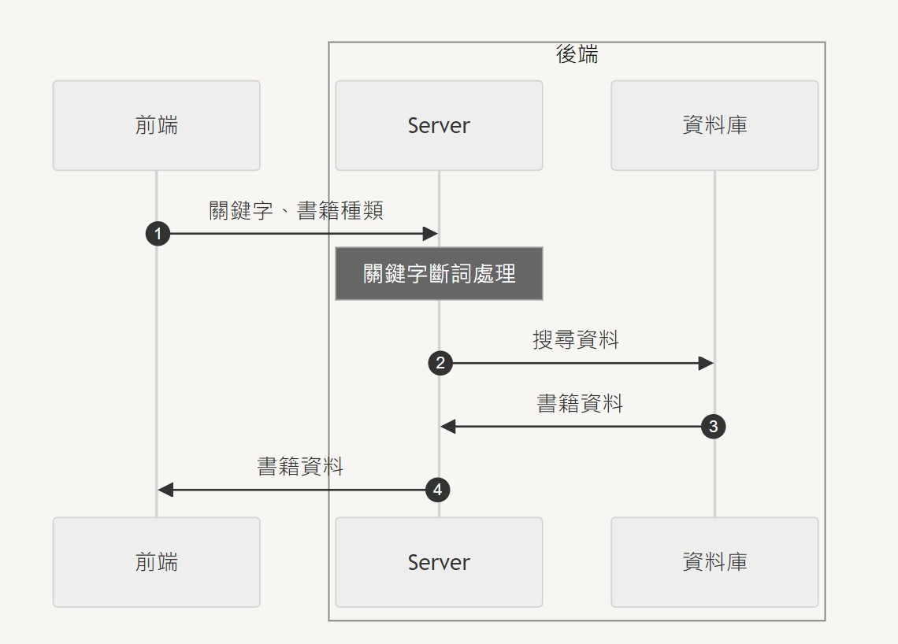

# Book Clustering

## 系統架構圖


## 資料庫 ERD


## 工作目錄
以下操作皆在 `./book_clustering` 下執行

## 下載所需函式庫
```
pip install -r ./requirements.txt
```
另外還需下載斷詞模型，這需要一點時間
```
python ./model/download_model.py
```
預期輸出結果為 `search_str=['法律概論'], word_list=['法律', '概論']`

## 執行分群
```
python ./src/clustering_algo.py
```
若想修改分析資訊的話，可以自己改 `_test()` 裡的 `col`
> **NOTE**
> 
> `col` 至少要有兩個，最多當然就是三個

## 預期結果

### 只考慮兩個資訊
價錢與頁數 | 價錢與時間 | 頁數與時間
:---: | :---: | :---: |
 |  | 

### 考慮所有資訊
角度1 | 角度2 | 角度3
:---: | :---: | :---: |
 |  | 

> **NOTE**
> 
> 每次的分群結果可能不同

## 網頁執行
```
python ./src/main.py
```
* 登入頁面: <u>http://localhost:8000/login</u>
* 註冊頁面: <u>http://localhost:8000/register</u>
* 搜尋主頁: <u>http://localhost:8000/index</u>
> **NOTE**
> 
> 在搜尋主頁必須要等斷詞模型載入完畢再輸入，也就是等 cmd 出現 `ready!`
>
## 資料庫設定
新增一個 `.env` 並設定你的資料庫帳號與密碼
```
DB_USER = "你的帳號 (應該是 root)"
DB_PASSWORD = "你的密碼"
```
再來初始化資料庫
```
python ./src/lib/db_f.py
```
> **NOTE**
>
> 執行後會刪除整個資料庫並重新載入書籍相關的資訊，所以使用者資訊以及收藏書單都會被清除