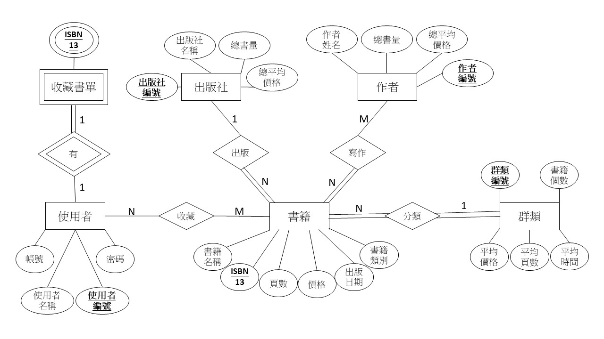

# Book Clustering

## 系統架構圖


## 資料庫 ERD


## 工作目錄
以下操作都在 `./book_clustering` 底下執行

## 下載所需函式庫
```
pip install -r ./requirements.txt
```
另外還需下載斷詞模型，這需要一點時間
```
python ./model/download_model.py
```
預期輸出結果為 `search_str=['法律概論'], word_list=['法律', '概論']`

## 執行分群
```
python ./src/clustering_algo.py
```
若想修改分析資訊的話，可以自己改 `_test()` 裡的 `col`
> **NOTE**
> `col` 至少要有兩個，最多當然就是三個

## 預期結果

### 只考慮兩個資訊
.png)
.png)
.png)

### 考慮所有資訊
.png)
.png)
.png)

> **NOTE**
> 每次的分群結果可能不同
