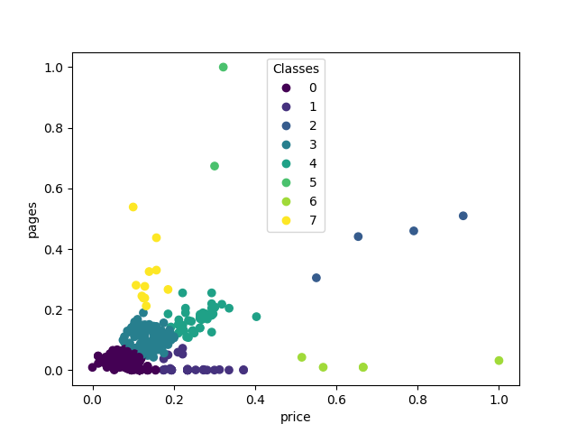

# Book Clustering

## 系統架構圖


## 資料庫 ERD


## 工作目錄
以下操作都在 `./book_clustering` 底下執行

## 下載所需函式庫
```
pip install -r ./requirements.txt
```

## 執行分群
```
python ./src/clustering_algo.py
```

## 預期結果


> **NOTE**
> 每次的分群結果可能不同
